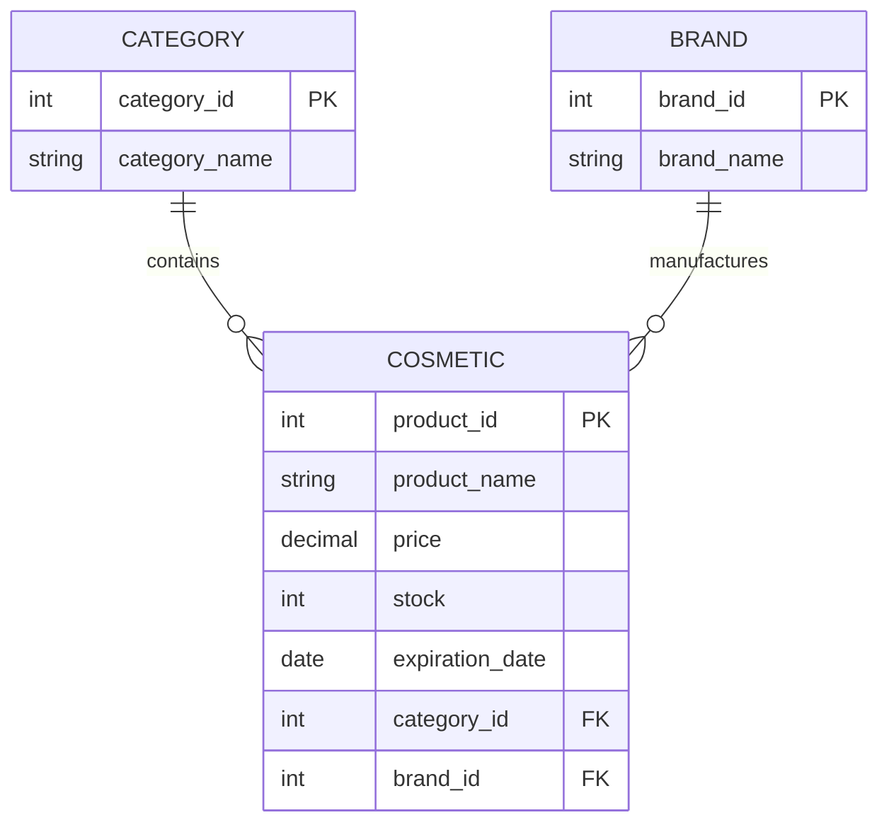

# Entity Relationship Diagram

This Entity Relationship Diagram represents the database structure for the Cosmetics CRUD System.

## Description

- **CATEGORY** stores the cosmetic categories (Lipstick, Foundation, Mascara, Skincare, etc.).
- **BRAND** stores the cosmetic brands.
- **COSMETIC** stores all product information, including name, price, stock, expiration date, category, and brand.
- One category can contain many cosmetic products.
- One brand can manufacture many cosmetic products.
